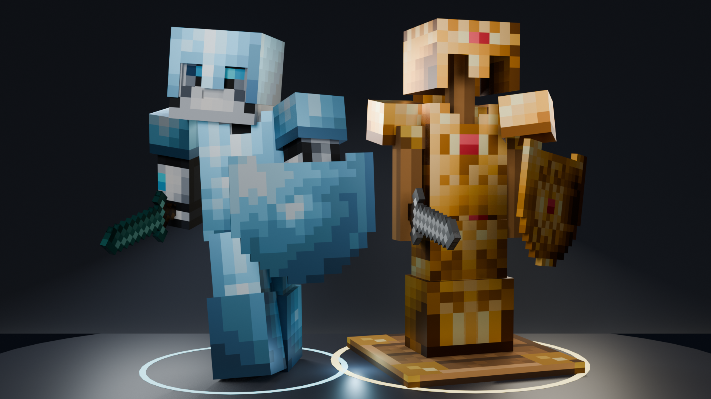

# X Player Armor (`x_player_armor`)

[](https://content.luanti.org/packages/SaKeL/x_player_armor/)
[](https://content.luanti.org/packages/SaKeL/x_player_armor/)

[](https://github.com/sakel-hub/x_player_armor/actions)
[](LICENSE.txt)
[](LICENSE.txt)
[](https://github.com/sakel-hub/x_player_armor/pulls)


A modern, high-performance player armor and shield mod for Luanti. Built to give players full 3D visual gear, active shield combat, and elemental survival perks while keeping your character skin completely intact and multiplayer gameplay butter-smooth.



---

## Gameplay & Features

- **Modular Bone-Attached 3D Armor & Shields**: Helmets, chestplates, leggings, boots, and shields attach directly to your character's skeletal bones as lightweight, optimized visual entities. Unlike legacy mods that replace your entire character with a baked armor model, your base player mesh and custom skin remain completely untouched.
- **Active Shield Defense & Arrow Deflection**: Hold right-click with an equipped shield to raise your guard. Blocking absorbs frontal melee attacks, deflects flying arrows with bounce physics, protects your worn armor from taking wear, and shows a first-person shield indicator. Features a dedicated API allowing third-party projectile and ranged combat mods to easily hook into arrow deflection.
- **Dynamic Combat HUD**: During battle, a sleek on-screen armor HUD appears automatically to show your gear's real-time durability so you always know when an item needs repair without opening your inventory.
- **Sound Effects & Particle Sparks**: Enjoy distinct audio effects and particle sparks when equipping gear, absorbing strikes, blocking attacks, deflecting arrows, or shattering broken armor.
- **Interactive Armor Stands**: Display your favorite armor sets in your base. Right-click to open a visual wardrobe manager, or simply Shift + Left Click with any item in hand to swap your equipped armor and held weapon with the stand in one click.
- **3D Inventory Preview**: Rotate and inspect your character in real-time 3D right inside your inventory screen (`sfinv`, `unified_inventory`, or `i3`). Features full dual-format support for classic 64x32 skins and 64x64 Format 1.8 skins with 3D outer layers (hat, jacket, sleeves, pants) from `skinsdb`, `clothing`, and other skin mods.
- **Matching Set Bonus**: Wearing a full 4-piece or 5-piece matching armor suit grants an automatic **+10% defense bonus**.
- **Lag-Free Multiplayer Performance**: Uses static, optimized visual entities with zero Lua tick overhead (`on_step = nil`). Bone tracking is offloaded directly to the Luanti engine's C++ scene graph, keeping multiplayer servers running at a solid 20 TPS with zero entity lag.
- **Full Drop-in Compatibility**: Works out-of-the-box with mods that expect classic `3d_armor`, `shields`, or `3d_armor_stand` APIs, and automatically migrates older saved inventories.

---

## Why Choose `x_player_armor` Over Classic `3d_armor`?

`x_player_armor` is a modern upgrade designed to give you better visuals, active combat, and smooth multiplayer performance while working seamlessly with all your existing mods and gear.

| Feature | Classic `3d_armor` | `x_player_armor` |
| :--- | :--- | :--- |
| **Visual Architecture** | Overrides your entire player model with a baked mesh (`3d_armor_character.b3d`) and flattened composite textures; blurs skins and strips away 3D clothing. | **Optimized Bone Attachments**: Attaches lightweight, static visual entities directly to your skeletal bones. Your base player model is never replaced, keeping skins and 3D outfit layers 100% intact. |
| **Multiplayer Performance** | Constantly polls world blocks and recalculates composite textures, causing tick lag, packet bloat, and server stutter. | **Zero-Tick Engine Attachments**: Visual entities run with zero Lua tick overhead (`on_step = nil`), tracked natively in C++ by the Luanti scene graph for lag-free multiplayer. |
| **Shield Combat & Deflection** | Shields are passive stat-sticks—you cannot raise a guard, block attacks, or deflect incoming arrows. | Active shield defense: hold right-click to raise your shield, reducing frontal damage, deflecting flying arrows with bounce physics, and absorbing wear directly onto the shield. Includes full API support for third-party projectile mods. |
| **First-Person Shield View** | No visual indication of raising a shield in first-person view. | A sleek 3D shield appears in your first-person view whenever you raise your guard. |
| **Combat Awareness HUD** | You must open your inventory mid-fight to check if your armor is about to break. | A handy mini-HUD appears during battle with clear color bars (green to red) and chime warnings before gear breaks. |
| **Interactive Armor Stands** | Multiple attached pieces can glitch, duplicate, or leave floating ghost items. | Rock-solid armor stands: Shift + Punch with any item in hand (or empty hand) to swap your equipped suit and held weapon in one click, with zero glitching. |
| **Smooth Movement** | Can clash with sprint and potion mods, causing stuttery movement or speed resets. | Plays nicely with sprint, hunger, and potion mods without interrupting your movement speed. |
| **Drop-In Upgrade** | — | Works instantly as a replacement—keeps all existing crafting recipes, mods, and saved player inventories. |

### Highlights at a Glance

- **Optimized Bone Attachments**: Attaches lightweight 3D entities directly to skeletal bones rather than overriding the player model with baked armor meshes.
- **Zero-Tick Multiplayer Performance**: Bone tracking is handled natively by the engine's C++ scene graph (`on_step = nil`), eliminating server tick overhead and lag spikes.
- **Keeps Your Look Intact**: Wear helmets, chestplates, leggings, and boots without turning your character skin into a flattened texture. All modern 3D skin layers (hats, jackets, sleeves) stay crisp and visible.
- **Active Shield Blocking & Arrow Deflection**: Raise your shield to mitigate frontal damage, deflect arrows with realistic bounce physics, absorb wear directly onto the shield, and view your shield in first-person. Third-party mods can easily tap into the deflection API.
- **Real-Time Battle HUD**: Never get surprised by broken gear in the middle of a dungeon. Color-coded health bars and audio warnings keep you informed at a glance.
- **One-Click Wardrobe Stands**: Shift-click an armor stand with any item in hand to instantly swap your armor suit and held weapon, or right-click to open a friendly visual wardrobe.
- **Effortless Switch**: Safe and simple to install on existing worlds—your armor items and crafting recipes carry over automatically.

---

## Armor Materials & Survival Perks

| Material | Defense Level | Health Regen | Durability | Survival Perks |
| :--- | :---: | :---: | :---: | :--- |
| **Wood** | 20 | 0% | 80 | Lightweight starter gear crafted from wood planks |
| **Cactus** | 24 | 0% | 110 | Desert survival with thorns that damage attackers |
| **Steel** | 45 | 0% | 350 | Dependable mid-game metal protection |
| **Bronze** | 50 | 0% | 450 | Tough copper-tin alloy defense |
| **Diamond** | 70 | 0% | 1200 | Exceptional durability and strong damage resistance |
| **Gold** | 40 | 12% | 200 | Regenerates player health over time |
| **Mithril** | 80 | 15% | 1800 | Legendary alloy with health regen and feather falling |
| **Crystal** | 75 | 10% | 1500 | Water breathing and fire protection |
| **Nether** | 85 | 5% | 2200 | Immune to lava, fire, and heavy explosions |
| **Admin** | 100 | 100% | Infinite | Invulnerability, flight, and environmental immunity |

---

## Modding & Extensibility

Mod developers can easily register custom armor items, shields, 3D models, sound effects, and combat callbacks:

```lua
-- Register a custom armor item
x_player_armor.register_armor("mymod:helmet_obsidian", {
    description = "Obsidian Greathelm",
    inventory_image = "mymod_inv_helmet_obsidian.png",
    texture = "mymod_helmet_obsidian.png",
    element = "head",
    groups = {
        armor_head = 1,
        armor_uses = 800,
        armor_fire = 1,
        physics_speed = 0.05,
    },
    armor_groups = {fleshy = 85},
    damage_groups = {cracky = 2, snappy = 1, level = 3},
})

-- Listen for armor equip, damage, and shield block events
x_player_armor.register_on_equip(function(player, index, stack)
    -- Triggered when an armor item is equipped
end)

x_player_armor.register_on_damage(function(player, index, stack, uses)
    -- Triggered when armor absorbs damage
end)

x_player_armor.register_on_block(function(player, hitter_or_proj, damage, shield_stack)
    -- Triggered when an attack or projectile is successfully blocked with a shield
end)
```

For complete class definitions, parameter types, callbacks, and subsystem methods, see the full **[API Reference (API.md)](API.md)**.

---

## Requirements & Compatibility

- **Luanti**: Version **5.10.0** or higher
- **Hard Dependencies**: **None** (zero hard dependencies — runs seamlessly in standalone custom games and arena servers)
- **Optional Integrations**:
  - `default` (Crafting recipes for cactus, steel, bronze, diamond, and gold gear)
  - `player_api` / `x_player_api` (Player animations and off-hand shield attachment)
  - `sfinv` / `unified_inventory` / `i3` (Inventory tabs and interactive 3D armor preview)
  - `shields`, `3d_armor`, `3d_armor_stand` (Legacy API shims and drop-in compatibility)

---

## Developer Tooling & Verification

The mod includes full developer scripts, testing harnesses, and Luanti static analysis:

```bash
# Run the 73-assertion automated unit test suite
npm test

# Run Luanti static analysis (Luacheck)
npm run lint

# Compile API.md from EmmyLua annotations using emmylua_doc_cli
npm run doc

# Extract, merge, and validate Gettext translations (*.po / *.pot)
npm run i18n

# Validate PO and POT catalogs
npm run i18n:check

# Inspect Weblate translation status
npm run weblate:status

# Sync Weblate translations
npm run weblate:sync-in
npm run weblate:sync-out

# Publish release package to ContentDB
npm run push:ci
```

---

## Author & Attribution

- **Mod Author**: SaKeL
- **Code License**: GNU Lesser General Public License v2.1 or later (LGPL-2.1+)
- **Media License**: Creative Commons Attribution-ShareAlike 3.0 (CC BY-SA 3.0), CC-BY 4.0 & CC0 1.0 (see [LICENSE.txt](LICENSE.txt))
